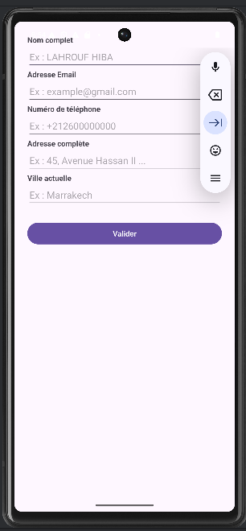
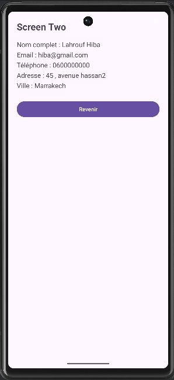

# Formulaire-et-navigation-entre-activit-s-Android-studio
# Application Android – Formulaire

Une application Android simple développée en **Java** et **XML** permettant de :

- Saisir des informations personnelles
- Vérifier les champs obligatoires
- Passer à un second écran
- Afficher un récapitulatif des données saisies

---

##  Fonctionnalités

- Formulaire de saisie :
  - Nom complet
  - Email
  - Téléphone
  - Adresse
  - Ville
- Validation basique (Nom et Email obligatoires)
- Navigation entre deux activités avec `Intent`
- Affichage d’un récapitulatif formaté
- Bouton retour vers l’écran principal

---

# Vidéo Démo

--

# Captures d’écran
### 📱 Écran principal

### 📄 Écran récapitulatif

